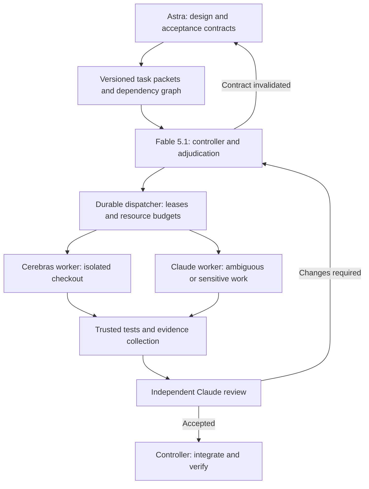

# Cerebras workers for the sports autopilot

Research date: 2026-09-12. Status: research and two adversarial reviews completed; recommendation revised below. This is a design investigation, not an instruction to start or modify the running autopilot. See the [review findings and dispositions](2026-09-12-cerebras-autopilot-adversarial-review.md).

The proposed direction is worth testing: Astra designs bounded units of work, Fable 5.1 remains controller, and a separate Cerebras worker process handles selected implementation tasks. Keep the existing strong reviewers and verification gates. Do not begin by assigning most work to Cerebras, changing the controller to Opus, or rebuilding the entire orchestration system. The deciding metric is time to an independently accepted change, including planning, tests, review, repair and integration.

## What the previous sessions establish

An aggregate scan using a cutoff of 08:49:21 UTC covered 17 top-level session files and 547 worker transcript files in `~/.claude/projects/-Users-trey-dev-sports/`, dating from September 6–12. These include design, reviews and operational work, not just autonomous implementation. The active session was still appending; these are a dated observation, not lifetime totals. Assistant usage records were deduplicated by message ID; Agent calls by tool-call ID. Token counts are transcript usage observations, not measured latency or billing. The [aggregate snapshot](2026-09-12-cerebras-autopilot-evidence/session-summary.json) and [read-only audit script](2026-09-12-cerebras-autopilot-evidence/audit_sessions.py) preserve the calculation.

The scan found 549 unique Agent calls across controllers and children: 298 explicitly requested Sonnet, 193 Opus, 36 Haiku, five Fable and 17 inherited. Worker metadata and assistant model IDs confirm that the aliases resolved to Sonnet 5, Opus 5 and Haiku 4.5; the main loop used Fable 5.1. This is already a heterogeneous system.

| Observed model/role | Unique assistant messages | Median input context | 90th percentile input context |
|---|---:|---:|---:|
| Fable 5.1, top-level sessions | 4,488 | 421,215 | 833,145 |
| Sonnet 5, workers | 14,185 | 125,922 | 308,205 |
| Opus 5, workers | 9,213 | 122,951 | 270,483 |
| Haiku 4.5, workers | 341 | 38,383 | 46,332 |

Input context sums uncached input, cache-read input and cache-creation input. Percentiles are weighted by model requests, not by tasks; long-running workers contribute more. These historical values mostly predate the new context recovery setup. They do not measure the benefit of its September 12 adoption. They do show why forwarding whole transcripts to 64–131k endpoints will fail.

Specific findings worth retaining:

- The [September 7 optimization session](/Users/trey/.claude/projects/-Users-trey-dev-sports/78bcfa4b-3785-4dc7-8501-ef6d828cc306.jsonl) already introduced Sonnet implementers, Opus reviewers on sensitive paths, parallel worktrees, deterministic verification and high effort. The reviewer caught a forced tick that could spend Odds credits during quiet hours. Review was doing useful work.
- [Phase 5's ledger](2026-09-10-phase5-sdd-ledger.md) records a six-minute database-drop block, checkpoint contention on the 2 GB test VM, memory pressure from four simultaneous suites, and a process-count check that raced when three suites started together. Distinct databases did not isolate the shared database server's resources.
- [Phase 6C's ledger](2026-09-11-phase6c-sdd-ledger.md) records Task 4 importing Task 1's new module despite a plan dependency of “none.” Task 2's reviewer found inactive variants included, inconsistent timestamps, incorrectly pooled fills, and unnecessarily loading full notes for 25,000 rows. Task 9 needed independent tests of side identity and actual query plans.
- [Phase 6A's ledger](2026-09-11-phase6a-sdd-ledger.md) records a reviewer catching a new eligibility metadata key being rendered as a phantom criterion by an existing dashboard consumer. A small, locally correct edit can have distant consumers.
- The September 11 session `80379b9a` points to `/Users/trey/dev/sports-review-2026-09-11/README.md`, whose historical audit says 20 of carried fixes 21–41 were first found on the NAS. This is an earlier review's finding, not a freshly reproduced production measurement. The later [reconciliation](2026-09-11-phase6-roadmap/RECONCILIATION.md) corrects multiple conclusions from that review. This is evidence for independent semantic checks and careful consolidation, not evidence that reviewer votes establish truth.
- The September 12 context-recovery session `2d0586dc` merged routed instructions, durable recovery and a 500k compaction threshold. Evaluate the new baseline before crediting Cerebras with those improvements.

Current governing files are [the autopilot skill](../../../.claude/skills/autopilot/SKILL.md), [phase procedure](../../../.claude/skills/autopilot/references/phase.md), and [state](../autopilot/state.md). The loop currently allows three implementers; the latest state separately warns against more than two simultaneous suites. These are separate resource limits. The state also records production IO and memory problems; faster code generation does not remove production verification or calendar waits.

Three reconstructed task timelines make the uncertainty concrete. Times below are September 11 CT, from the linked ledgers; “merge” means recorded task-branch acceptance, not final phase verification.

| Task | Dispatch → first report | First report → task merge | Total | What the record reveals |
|---|---:|---:|---:|---|
| 6A T5, capsule runbook | 17:41–17:43, 2 min | 17:43–17:44, 1 min | 3 min | Docs-only, no suite; already a cheap task |
| 6C T5, README/gate test | 15:17–15:46, 29 min | 15:46–15:49, 3 min | 32 min | Full suite included; a missing clean-book condition still reached the final review |
| 6C T2, diagnostic query/report | 15:07–15:47, 40 min | 15:47–16:15, 28 min | 68 min | Four Important findings, a repair and re-review; merge gate was relaxed by ruling |

These intervals include tool execution, queueing, model work and coordination. The logs do not provide a trustworthy inference-only critical-path split; claiming a measured project speedup from them would be false. They do show why counting all three as interchangeable “grunt work” loses the relevant distinctions. [6A ledger](2026-09-11-phase6a-sdd-ledger.md), [6C ledger](2026-09-11-phase6c-sdd-ledger.md).

## What Cerebras actually offers

The public catalog lists two shared models. Advertised generation rates are vendor figures, not measured task completion speeds. [Cerebras model catalog](https://inference-docs.cerebras.ai/models/overview).

| Worker candidate | Advertised tokens/second | Advertised trial / paid context | Public metadata price per million input / output tokens |
|---|---:|---:|---:|
| `gpt-oss-120b` | ~3,000 | 65k / 131k | $0.35 / $0.75 |
| `qwen-3.8-27b` | ~1,850 | 64k / 128k | $0.99 / $1.49 |

Prices are from the [public models endpoint](https://api.cerebras.ai/public/v1/models). That endpoint reports 131,072 context and 40,960 maximum completion tokens for GPT OSS, but 65,536 context and 32,768 completion for Qwen. It also reports GPT OSS parallel tool calling disabled, whereas the tool guide says it is supported. Treat these as unresolved endpoint/account differences; use conservative limits and smoke-test the authenticated endpoint before enabling larger contexts or parallel tool calls.

Qwen supports vision; GPT OSS does not. Both expose tools and structured outputs. The worker must execute tools itself; inference does not provide a filesystem, shell or test runner. [Tool calling](https://inference-docs.cerebras.ai/capabilities/tool-use).

GLM 5.1, Qwen3-Coder, MiniMax M2.5 and other families are listed for dedicated endpoints. Kimi K2.7 Code is listed for dedicated service/customer trials. None is a justified assumption for a self-serve pilot. Dedicated capacity requires a separate commercial arrangement. [Dedicated endpoints](https://inference-docs.cerebras.ai/dedicated/overview), [reasoning availability](https://inference-docs.cerebras.ai/capabilities/reasoning).

Published PayGo limits also disagree. The inference guide lists GPT OSS at 1M uncached TPM / 3M total TPM / 1,000 RPM, and Qwen at 150k / 450k / 300 RPM. The support FAQ gives GPT OSS 500k uncached TPM and Qwen 450 RPM. Account limits and response headers must decide admission. Prompt tokens and reserved completion tokens both matter; cached and total-token limits are distinct. [Rate limits](https://inference-docs.cerebras.ai/support/rate-limits), [PayGo FAQ](https://support.cerebras.net/articles/5041581099-cerebras-self-serve-paygo-faq).

A 3,000-token/s decoder cannot sustain three workers each emitting 3,000 tokens/s under a 500k TPM budget: output alone would be 540k tokens/minute, before inputs. Do not multiply headline speed by worker count.

GPT OSS starts at medium reasoning and cannot disable it; Qwen defaults to high and supports none/low/medium/high. Reasoning consumes completion budget. Pin the setting in experiments; hiding reasoning does not eliminate its token cost. [Reasoning controls](https://inference-docs.cerebras.ai/capabilities/reasoning).

## Proposed architecture

Keep Fable as controller for the first experiment because it is the observed baseline. The session corpus does not contain a controlled Opus-versus-Fable controller comparison. Test that choice later with identical workers and task packets. Astra is appropriate for architecture and cross-system decisions, but front-load a ready milestone/wave and its invariants rather than freezing every implementation detail for the whole roadmap. New facts trigger targeted redesign.

Astra's deliverable should contain: goal and exclusions; exact base commit; input/output contracts; error, time, ordering and identity semantics; migration constraints; file ownership; dependency graph including imports, shared schemas and consumers; executable acceptance examples; semantic failure cases; resource bounds; and explicit escalation triggers. Review those contracts independently before implementation. A strong planner can still encode a wrong premise, as the historical reconciliation demonstrates.

Evaluate three separate questions: does the patch obey the packet; is the packet itself correct against governing requirements and actual producers/consumers; and does the implementation work under operational/resource constraints? An evaluator should derive hidden cases from those independent sources before seeing the packet or patch. Use conservation, ordering and identity properties where applicable. A bad packet counts as a planning failure even if both worker arms implement it perfectly. “Independent model” alone does not mean independent evidence.

Each worker receives only its task packet, relevant source and authoritative rule excerpts. Suggested initial context target: 10–25k tokens; bound tool outputs and reserve room for reasoning and the patch. This is a proposed starting budget to test, not a measured optimum. Source access remains available for discovering callers; required context that cannot fit causes escalation, not silent omission of rules.

Use a separate worker process invoked through a small local CLI; add MCP only if typed asynchronous dispatch becomes useful. Its API could be `submit(packet) -> job_id`, `status(job_id)`, `cancel(job_id)` and `result(job_id)`. The controller continues using normal Claude subagents for reviews. Anthropic documents Claude model aliases and explicitly does not support non-Claude models through gateways, so a Cerebras model string is not a supported native subagent switch. [Claude subagents](https://code.claude.com/docs/en/sub-agents), [gateway support](https://code.claude.com/docs/en/llm-gateway).

Evaluate an existing Cerebras-compatible runner before building an agent runtime. OpenCode has an official Cerebras integration and a noninteractive CLI; Aider is another editing-oriented candidate. A thin wrapper still must enforce the project task contract, record evidence, and manage resources. Neither integration alone proves safe unattended behavior. [Cerebras/OpenCode](https://inference-docs.cerebras.ai/integrations/opencode), [OpenCode CLI](https://opencode.ai/docs/cli/), [Cerebras/Aider](https://inference-docs.cerebras.ai/integrations/aider).

Required wrapper behavior for eventual unattended integration (the first supervised offline screen does not build all of this):

1. Freeze base SHA, task ID, packet version/hash, model and reasoning settings. Each attempt owns a unique isolated worktree and test database.
2. Persist job state, process identity, lease, heartbeat, attempt number, stdout/stderr and result artifacts. Fence results by attempt ID and lease generation; reject stale completions. Recovery checks actual processes and files before issuing another attempt, stopping or quarantining an old process group before retrying in a new checkout. Never reuse a checkout still owned by an earlier attempt. The controller owns Git integration and shared ledgers.
3. Use an atomic global test semaphore; start with one full suite at a time and measure whether two improve throughput. Model concurrency, implementation slots and database-test slots are separate budgets. Queue database creation/drop operations under the appropriate resource lock too.
4. Return a patch/commit plus machine-readable status, touched files, test evidence and unresolved questions. A worker's DONE or “tests passed” statement is not acceptance evidence. Stop candidate mutation before snapshotting; bind trusted evidence and review to the exact candidate SHA, packet and test environment/configuration. Invalidate them after a rebase or relevant further edits.
5. Validate changed files and dependencies. Disjoint files are necessary but insufficient for parallel tasks: semantic dependencies and readers of altered schemas count too.
6. Run workers and their generated tests without controller credentials, SSH agent access, Docker socket, production access or writable controller state. Worktrees alone are not isolation. A prompt saying “no NAS access” cannot enforce it. A separate filesystem/process boundary and restricted network are required; testing generated code is also code execution. The existing worktree helper symlinks the controller's `.venv`, and the database helper uses a common database-creation role. For the pilot, prefer pure Python tasks requiring neither shared environment writes nor Postgres. For database tasks, a trusted supervisor must provision an isolated disposable database/environment and expose only a task-scoped test operation; its administrative credentials stay outside the worker. `localhost` inside a sandbox is not automatically the host's test server. Do not solve connectivity by mounting the host home or opening broad network access. [Worktree helper](../../../scripts/worktree.sh), [database helper](../../../scripts/testdb.py).
7. Set per-job time, output, tool-call and spend bounds. In the pilot, permit one bounded repair attempt, then escalate to Claude. NEEDS_CONTEXT or conflicting contracts go to the controller immediately. Do not repeat the same failed prompt at high speed.
8. Separate inference throttling from code failure. Honor provider headers and persist cooldowns; do not loop through models/keys to evade a quota. Keep the existing Claude subscription pause behavior. Any future automatic provider fallback must be specified before launch and accounted for, not improvised under pressure. The supervisor enforces limits for the controller too: “docs-only” or “deadline” rulings cannot create a fourth implementer or bypass an evidence gate. Use a single-controller lease; record and fail closed on unauthorized transitions.

The Cerebras adapter should be tested against API v2, including complete tool-call/result pairing, strict schemas, reasoning fields and truncated completions. GPT OSS's system/developer-role handling is also adapter-specific. OpenAI-compatible Chat Completions is not full compatibility with every OpenAI endpoint or agent framework. [API versions](https://inference-docs.cerebras.ai/api-reference/versions), [compatibility](https://inference-docs.cerebras.ai/resources/openai).

## Route by uncertainty and impact

| Task | Initial route |
|---|---|
| Complete, mechanically applicable patch already specified | Script/template first; model only if editing judgment is needed |
| Documentation update against a fixed contract; fixture builder; repetitive CLI wiring; small pure helper | Cerebras candidate, independent current-tier review |
| Bounded implementation with known interfaces and meaningful regression tests | Cerebras shadow experiment, then eligible class only |
| Reconnect semantics, order/fill identity, settlement correctness, research validity, migration design, unmeasured SQL plans | Claude implementer and strong reviewer; Astra for contract decisions |
| Cross-cutting diagnosis, NAS incident, architecture, changed scientific assumptions | Fable/Opus/Astra; do not label these grunt work by diff size |
| Final integration, operational verification, authority changes | Existing controller and gates |

Benchmark GPT OSS and Qwen on the same packets. GPT OSS is the cheaper, faster advertised text candidate; Qwen is a candidate for quality and visual tasks. There is no project evidence yet that either matches Sonnet 5, and no reason to select by parameter count or an unrelated coding leaderboard. Preserve sensitive-path review allocations even when a patch is tiny.

Admission requires positive evidence of known consumers, stable semantics, bounded resource use and meaningful trusted acceptance checks. Labels such as “test,” “fixture,” “pure helper” and “documentation” do not establish low risk: a fixture defining order identity or a README defining scientific acceptance stays sensitive. Newly discovered consumers, imports, schema dependencies or scope changes invalidate the packet and force routing/scheduling review. Include two deliberately misclassified offline challenges to test this rule. Record the fraction of real ready work that qualifies, as well as false admissions and escalations.

## Expected speed and cost

For a fixed critical path, let `p` be the fraction of baseline elapsed time in inference actually replaced, and `s` the effective acceleration of that portion. Ignoring added overhead, speedup is `1 / ((1-p) + p/s)`. If `s=10`, then `p=0.25` gives 1.29x, `p=0.50` gives 1.82x, and `p=0.75` gives 3.08x. These are sensitivity calculations, not forecasts. Tool execution, tests, strong review, queueing, deployments and calendar windows all sit outside the accelerated portion. New planning, retries and integration add time.

Quality-adjusted benefit requires the worker-time savings to exceed extra packet preparation, review, repair, escalation and integration. A single additional strong-model repair round can erase seconds saved across many fast generations. Worker-context reduction and deterministic scheduling are valuable independently of provider choice.

Also require `remaining eligible tasks × net minutes saved per task > setup and maintenance minutes`. A task-class win that covers little of a milestone's critical path will not meet the user's project-wide speed goal. Track milestone lead time and cap work awaiting review, so faster drafting does not merely create a growing review queue.

For an illustrative task with 20 requests totaling 400k input tokens and 40k output/reasoning tokens, public rates imply $0.17 on GPT OSS or about $0.456 on Qwen, before review/controller/planning costs. This is not the observed token shape of this project. Cerebras currently bills cached input at its standard input rate: caching helps input latency and uncached-token admission, not token price. At 100 such jobs, worker inference is roughly $17 or $45.56. Costs grow with accumulated conversation history. [Cache behavior and pricing](https://inference-docs.cerebras.ai/capabilities/prompt-caching).

That example also exposes quota limits: at 150k uncached TPM, a continuously loaded Qwen queue consumes about 176 seconds of replenishment capacity for each fully uncached 440k-token job, even though 40k output tokens take only about 22 seconds at the advertised decoder speed. Initial bucket capacity, caching and total-token limits change individual-job latency. Separate incremental Cerebras spend from the existing Claude subscription; do not count subscription-covered Claude tokens as avoidable API dollars. An Astra planning request with 100k input and 10k output is $1.50 at standard API rates, before any other charges; usage in this app is not necessarily API billing. [Astra model pricing](https://developers.openai.com/api/docs/models/gpt-6-astra).

## Pilot that can answer the question

First measure the recovered current loop and instrument dispatch-ready, model request, tool execution, test queue, suite run, review queue, repairs and acceptance timestamps. Overlapping agent durations cannot simply be summed into wall time. Separate active development lead time from waiting for an operational window.

For the later accepted-change evaluation, use four comparisons on prospective tasks or properly isolated historical bases:

- A: current Claude workflow and original task briefing.
- B: Astra packet, same Claude workers/review policy, improved dispatcher.
- C: same packet/dispatcher/review policy as B, GPT OSS workers.
- D: same packet/dispatcher/review policy as B, Qwen workers.

B versus C/D compares the worker stack, including runtime if Claude uses native subagents and Cerebras uses OpenCode. It cannot attribute a gain solely to model or inference hardware. For model attribution, add a same-runtime Claude API arm with identical tools and packets, separately accounting for its API cost. The first decision only needs a fair operational comparison; it does not require this extra arm. A versus B includes planning and harness improvements and must charge their preparation cost. Match hardware and test scheduling. Randomize/interleave runs rather than giving one arm an idle database and another a saturated one.

Historical replay requires sanitized source exports or freshly initialized repositories containing only the original base. Ordinary worktrees share Git history and can expose future fixes. Isolate the planner, worker and runtime from later commits, reviews, logs, fixtures and expected patches. The Astra session doing this investigation has already seen later findings and must not author supposedly blind historical benchmark packets; use a fresh planning session with restricted historical inputs. Evaluators keep independent tests and known failure cases private. Fresh prospective tasks are the final check against historical leakage.

For that later screening, choose 12–20 representative tasks, including several mechanical tasks and several tempting-but-dangerous small changes. Candidate historical cases include the phase 6C week helper and CLI/report wiring, phase 6A fixture/manifest work, the phase 6C cross-variant fill query, and the reconnect watermark defect described in reconciliation. Sensitive cases are off-line challenge cases only; a pass does not authorize routing them live. Include valid alternative implementations and ask reviewers to assess contracts rather than match old patches.

Preserve existing reviews and full-suite gates in the accepted-change evaluation and for any integration. Add independent semantic tests where needed; no passing grade from only worker-authored tests. Blind the reviewer to model identity where practicable. The current reviewer can fix Minors: record its verdict and defects against the pre-repair SHA first, then record reviewer edits, time and the post-repair SHA separately. Otherwise the evaluator quietly becomes an unmeasured implementer. Measure first-pass acceptance, severity-weighted defects, review effort, repairs/escalations, total elapsed time, cost per accepted task and controller interventions. Record failures and escalations as outcomes; do not calculate latency only over successful fast jobs. Follow a limited canary through normal integration/verification to detect regressions that unit replay misses.

Suggested screening threshold: at least 25% lower median route-to-acceptance time than B for the chosen task class, no worse tail behavior, no observed additional Important/Critical escapes, and no greater median reviewer effort. Include Claude fallback time for escalated jobs and report terminal failures separately without dropping them from the denominator. These are proposed practical gates, not proof of statistical equivalence. Before a larger evaluation, freeze the task population, severity rubric, comparator, material-regression definition, non-inferiority margin and analysis method; cluster related tasks and choose sample size from baseline failure rates and the desired uncertainty. A small replay sample cannot establish “same quality.” Broader routing needs that evaluation and continued canary monitoring. If gains disappear after review, keep the improved harness with Claude workers.

Smallest next step: one offline paired batch of six bounded tasks, preferably upcoming tasks with packets and hidden checks frozen before implementation, plus two historical routing traps kept separate. Use sanitized bases, one externally supervised worker, one test slot, captured usage and independent pre-repair review. Check actual account capabilities and multi-turn tool behavior first. Start with current Claude versus GPT OSS; add Qwen if GPT OSS's quality/repair tradeoff warrants the second candidate. Limit this first screen to tasks that can be scoped-validated without Postgres; report draft-plus-scoped-validation/review time and errors, never call it fully accepted-change time or use the 25% promotion threshold yet. No candidate merges. It can reject an unworkable adapter or excessive repair overhead cheaply, but cannot prove the throughput goal.

That first screen does not need a durable dispatcher, an MCP server, database isolation infrastructure or live-loop integration. Build the required evaluation isolation only if it warrants proceeding. The 12–20-task trial then measures complete acceptance with all required suites, integration and review, followed by fresh canary tasks and a larger quality evaluation before broad adoption. Test Opus as controller in a later, separate comparison.

The current skill fixes model allocation and forbids autonomous self-modification or adding services/dependencies. Research does not activate those changes. A later setup change would explicitly define the new worker route, credentials, limits and evidence contract, and enter at a reconciled session boundary. No paid inference, provider configuration, operational state mutation, merge or deployment was performed for this investigation.
